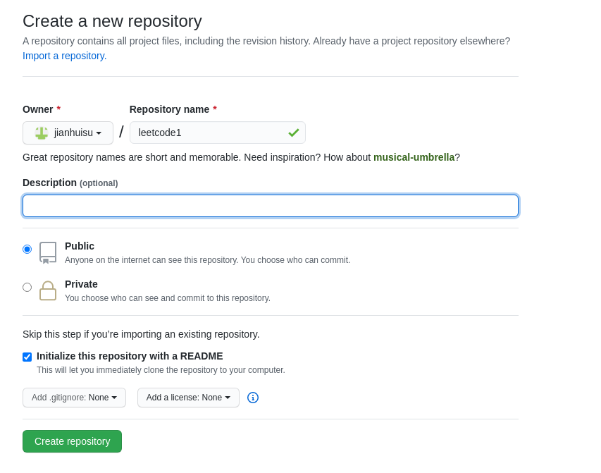

# how to map a local git repository with a remote

there has existed some files in leetcode dir

    sujianhui@dev529> pwd
    /home/sujianhui/CLionProjects/leetcode

init dir `leetcode` become a local git repository.

    sujianhui@dev529> git status
    fatal: Not a git repository (or any parent up to mount point /home)
    Stopping at filesystem boundary (GIT_DISCOVERY_ACROSS_FILESYSTEM not set).
    
    sujianhui@dev529> git init
    Initialized empty Git repository in /home/sujianhui/CLionProjects/leetcode/.git/

view repository config

    sujianhui@dev529> git config --list
    user.email=1051034413@qq.com
    user.name=sujianhui
    push.default=simple
    core.repositoryformatversion=0
    core.filemode=true
    core.bare=false
    core.logallrefupdates=true

create a remote repository on github.

add remote repository address to local repository

    sujianhui@dev529> git remote add origin https://github.com/jianhuisu/C.git
    sujianhui@dev529> git config --list
    user.email=1051034413@qq.com
    user.name=sujianhui
    push.default=simple
    core.repositoryformatversion=0
    core.filemode=true
    core.bare=false
    core.logallrefupdates=true
    remote.origin.url=https://github.com/jianhuisu/C.git
    remote.origin.fetch=+refs/heads/*:refs/remotes/origin/*
    
    sujianhui@dev529> git remote add origin https://github.com/jianhuisu/leetcode.git
    fatal: remote origin already exists.
    sujianhui@dev529> git remote remove origin
    ......
    sujianhui@dev529> git remote add origin https://github.com/jianhuisu/leetcode.git
    sujianhui@dev529> git config --list
    user.email=1051034413@qq.com
    user.name=sujianhui
    push.default=simple
    core.repositoryformatversion=0
    core.filemode=true
    core.bare=false
    core.logallrefupdates=true
    remote.origin.url=https://github.com/jianhuisu/leetcode.git
    remote.origin.fetch=+refs/heads/*:refs/remotes/origin/*

view status

    sujianhui@dev529> git status
    # On branch master
    #
    # Initial commit
    #
    # Untracked files:
    #   (use "git add <file>..." to include in what will be committed)
    #
    #       .gitignore
    #       .idea/
    #       CMakeLists.txt
    #       README.md
    #       cmake-build-debug/
    #       linked_list/
    nothing added to commit but untracked files present (use "git add" to track)

pull code

    sujianhui@dev529> git pull origin
    remote: Enumerating objects: 6, done.
    remote: Counting objects: 100% (6/6), done.
    remote: Compressing objects: 100% (2/2), done.
    remote: Total 6 (delta 0), reused 0 (delta 0), pack-reused 0
    Unpacking objects: 100% (6/6), done.
    From https://github.com/jianhuisu/leetcode
     * [new branch]      master     -> origin/master
    
    sujianhui@dev529> git pull
    There is no tracking information for the current branch.
    Please specify which branch you want to merge with.
    See git-pull(1) for details
    
        git pull <remote> <branch>
    
    If you wish to set tracking information for this branch you can do so with:
    
        git branch --set-upstream-to=origin/<branch> master
    
    sujianhui@dev529> git checkout master
    Branch master set up to track remote branch master from origin.
    Already on 'master'
    sujianhui@dev529> git branch --set-upstream-to=origin/master master
    Branch master set up to track remote branch master from origin.
    sujianhui@dev529> git branch -vv
    * master 701d194 [origin/master] Update README.md
    sujianhui@dev529> git pull
    Already up-to-date.
 
