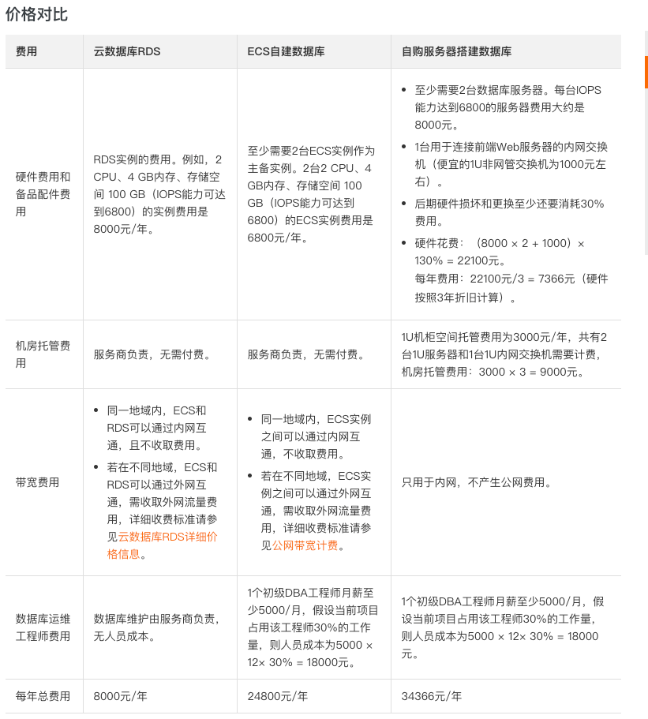
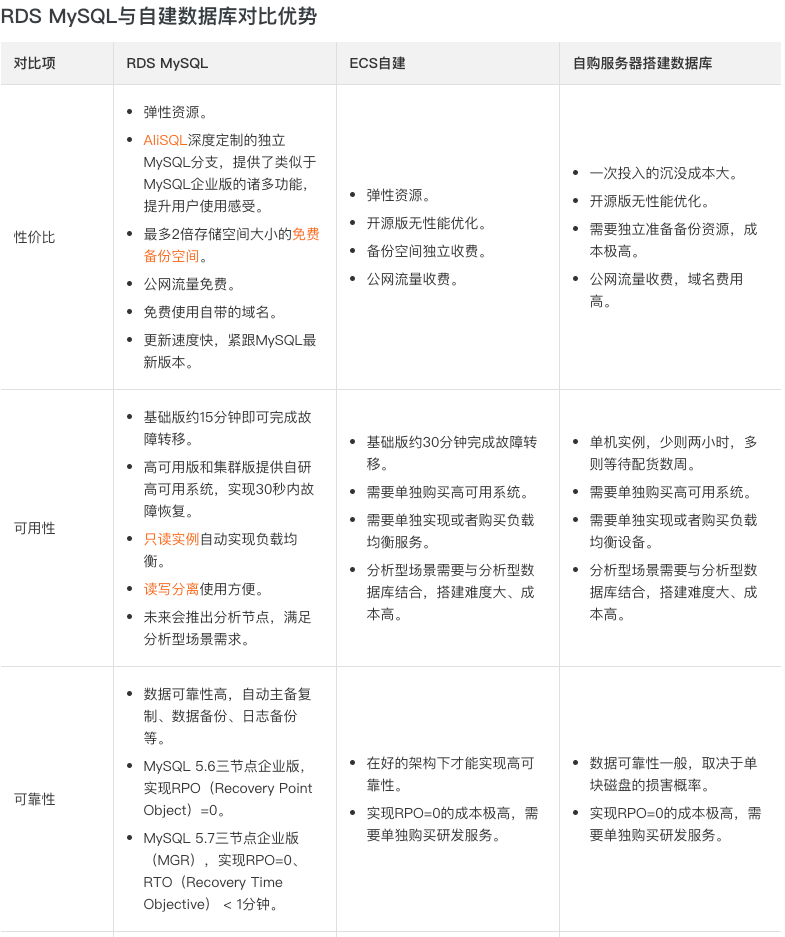
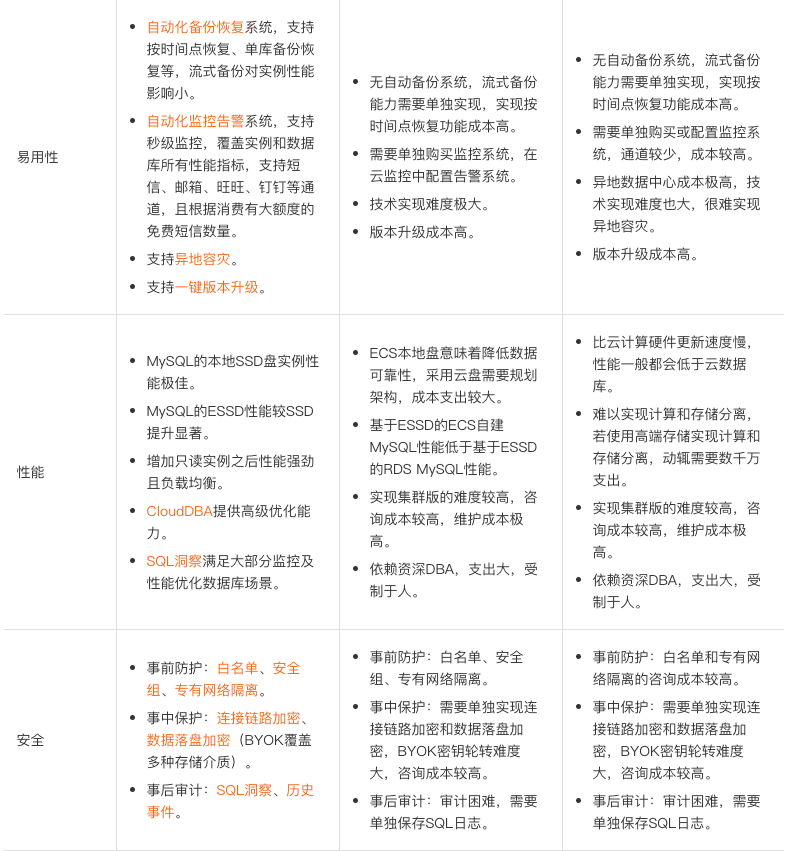

# RDS与自建数据库对比优势

云数据库RDS提供高可用、高可靠、高安全、可扩展的托管数据库服务，性能等同于商业数据库，但是价格相比ECS自建数据库，仅需约1/3，相比自购服务器搭建数据库，仅需约1/10。

价格对比

`RDS mysql`与自建数据库优势对比

比较关键的点

 - 只读实例自动实现负载均衡
 - 读写分离使用方便

### 开通读写分离

读写分离是指通过`独享代理地址`（读写分离地址）实现读写请求的自动转发。
(与laravel框架中的读写分离策略-DML-DQL不同).

前提条件

 - 实例为主实例（不是只读实例或灾备实例）。
 - 开通独享代理。
 - 拥有只读实例。

延迟阈值

只读实例同步主实例数据时允许的最长延迟时间。若一个只读实例的延迟时间超过该阈值，则不论该只读实例的权重是多少，读请求都不会转发至该只读实例。
取值范围为0秒到7200秒。受限于SQL的执行情况，只读实例有一定的几率会出现延迟，建议该值不小于30秒。

读权重分配

实例的读权重越高，处理的读请求越多。例如，假设主实例有3个只读实例，读权重分别为0、100、200和200，则表示主实例不处理读请求（写请求仍然自动发往主实例），3个只读实例按照1：2：2的比例处理读请求。
系统分配：系统根据实例规格自动分配各个实例的读权重。后续该主实例下新增的只读实例也会自动按照系统分配的权重加入到读写分离链路中，无需手动设置。更多信息请参见系统权重分配规则。
自定义：手动设置各个实例的读权重，范围为0至10000。后续该主实例下新增只读实例的读权重默认为0，需要您手动修改。

### 原文地址

https://help.aliyun.com/knowledge_detail/41875.html?spm=5176.13910061.sslink.1.3c1646f7lgUEaX

https://help.aliyun.com/document_detail/96073.html?spm=a2c4g.11186623.2.12.787f387asAsJBA