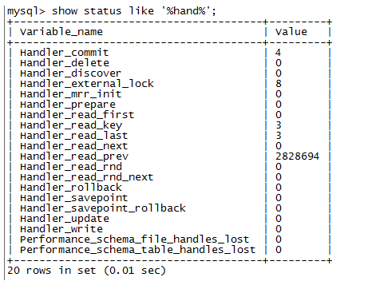
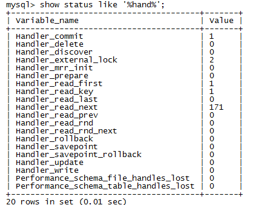

## mysql的handler_read_next理解

简介： mysql，handler_read_next
image

研发提问：执行计划这么优秀，扫描了143行记录就得出结果，怎么还需要0.68s这么长的时间？

废话不多说，直接上实验。清空status状态，再执行sql语句，查看handler状态：

    mysql> flush status;
    mysql> SELECT * FROM trade_quotation WHERE symbol = 'LTC' ORDER BY id DESC LIMIT 30;
    mysql> show status like '%hand%';
   

解释一下各个参数：

 - `Handler_read_first`：此选项表明SQL是在做一个全索引扫描，注意是全部，而不是部分，所以说如果存在WHERE语句，这个选项是不会变的。
 - `Handler_read_key`：此选项数值如果很高，那么恭喜你，你的系统高效的使用了索引，一切运转良好。
 - `Handler_read_next`：此选项表明在进行索引扫描时，按照索引从数据文件里取数据的次数。
 - `Handler_read_prev`：此选项表明在进行索引扫描时，按照索引倒序从数据文件里取数据的次数，一般就是ORDER BY … DESC
 - `Handler_read_rnd`：就是查询直接操作了数据文件，很多时候表现为没有使用索引或者文件排序。
 - `Handler_read_rnd_next`：此选项表明在进行数据文件扫描时，从数据文件里取数据的次数。

可以看到这个sql的Handler_read_prev为2828694，该值已经非常的高。所以这个sql即便索引使用正确，
也还是需要0.68s这么长的时间，同样我们可以看一下将desc换成asc时候的Handler_read_next：

    mysql> flush status;
    mysql> SELECT * FROM trade_quotation WHERE symbol = 'LTC' ORDER BY id aSC LIMIT 30; 
    mysql> show status like '%hand%';
    

顺序扫描171次即可返回结果，因此该sql查询起来很快。