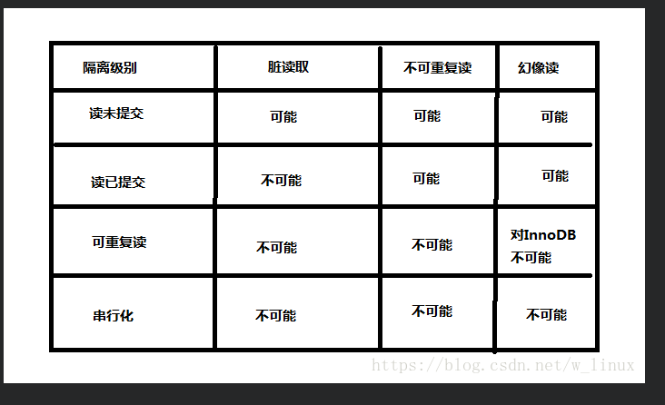

## Transaction

事务是逻辑上的一组操作，要么都执行，要么都不执行。
**mysql事务处理可以用来维护数据库的完整性，保证成批的 SQL 语句要么全部执行，要么全部不执行**.

假如小明要给小红转账1000元，这个转账会涉及到两个关键操作就是：
    
 1. 将小明的余额减少1000元，
 1. 将小红的余额增加1000元。
 
万一在这两个操作之间突然出现错误比如银行系统崩溃，**导致小明余额减少而小红的余额没有增加**

 - 原子性（Atomicity）   原子性是指事务是一个不可分割的工作单位，事务中的操作要么都发生，要么都不发生。
 - 一致性（Consistency） 一致性表示事务完成后，符合逻辑运算，符合我们的期望.
 - 隔离性（Isolation）   事务的隔离性是多个用户并发访问数据库时，数据库为每一个用户开启的事务，不能被其他事务的操作数据所干扰，多个并发事务之间要相互隔离。
 - 持久性（Durability）  持久性是指一个事务一旦被提交，它对数据库中数据的改变就是永久性的，接下来即使数据库发生故障也不应该对其有任何影响

查询当前系统的事务隔离级别

    mysql> select @@transaction_isolation;
    mysql> show variables like 'transaction_isolation';
    +-------------------------+
    | @@transaction_isolation |
    +-------------------------+
    | REPEATABLE-READ         |
    +-------------------------+
    1 row in set (0.00 sec)

四种事务隔离级别

 - 串行化    Serializable	 可避免脏读、不可重复读、虚读情况的发生。 **它要求所有的事务都被串行，不能并发的处理**
 - 可重复读  Repeatable read	 可避免脏读、不可重复读情况的发生。 
   (这个级别是Mysql的默认隔离级别，理论上这个级别不能避免幻读的问题，但是Mysql在这个级别上就成功的避免了脏读，不可重复读和幻读三种问题)
 - 读已提交  Read committed	  可避免脏读情况发生。
 - 读未提交  Read uncommitted  最低级别，以上情况均无法保证。
 
事务中常出现的三种问题

 - 脏读：所谓的脏读，其实就是读到了别的事务回滚前的脏数据。
 - 不可重复读：在一个事务过程中，多次读取到的数据不一致。
 - 幻读：事务A首先根据条件索引得到N条数据，然后事务B改变了这N条数据之外的M条或者增添了M条符合事务A搜索条件的数据.
 - 更新丢失（Lost Update）：当两个或多个事务选择同一行，然后基于最初选定的值更新该行时，由于每个事务都不知道其他事务的存在，就会发生丢失更新问题

#### 事务四大特性之一————隔离性(isolation)

事物A和事物B之间具有一定的隔离性
隔离性有隔离级别(4个)

 - 读未提交：read uncommitted
 - 读已提交：read committed
 - 可重复读：repeatable read
 - 串行化：serializable
 
1、 read uncommitted

    - 事物A和事物B，事物A未提交的数据，事物B可以读取到
    - 这里读取到的数据叫做“脏数据”
    - 这种隔离级别最低，这种级别一般是在理论上存在，数据库隔离级别一般都高于该级别

2、read committed

    - 事物A和事物B，事物A提交的数据，事物B才能读取到
    - 这种隔离级别高于读未提交
    - 换句话说，对方事物提交之后的数据，我当前事物才能读取到
    - 这种级别可以避免“脏数据”，避免其它事务执行过程中产生的垃圾数据.
    - 这种隔离级别会导致“不可重复读取”
    - Oracle默认隔离级别

3、repeatable read

    - 事务A在读到一条数据之后，此时事务B对该数据进行了修改并提交，那么事务A再读该数据，读到的还是原来的内容
    - 这种隔离级别高于读已提交
    - 换句话说，当前事务不会读取到其它事务提交之后的数据，当前事务在执行开始时读到的数据 与结束时读到的数据是一致的.
    - 这种隔离级别可以避免“不可重复读取”，达到可重复读取
    - 比如1点和2点读到数据是同一个
    - MySQL默认级别
    - 虽然可以达到可重复读取，但是会导致“幻像读”

4、serializable

    - 事务A和事务B，事务A在操作数据库时，事务B只能排队等待
    - 这种隔离级别很少使用，吞吐量太低，用户体验差
    - 这种级别可以避免“幻像读”，每一次读取的都是数据库中真实存在数据，事务A与事务B串行，而不并发
  
  

#### MySQL可重复读隔离级别的实现原理

1、原理
MySQL默认的隔离级别是可重复读，即：事务A在读到一条数据之后，此时事务B对该数据进行了修改并提交，那么事务A再读该数据，读到的还是原来的内容。 那么MySQL可重复读是如何实现的呢？
使用的的一种叫MVCC的控制方式 ，即Mutil-Version Concurrency Control,多版本并发控制，类似于乐观锁的一种实现方式

实现方式：
InnoDB在每行记录后面保存两个隐藏的列来，分别保存了这个行的创建时间和行的删除时间。这里存储的并不是实际的时间值,而是系统版本号，当数据被修改时，版本号加1
在读取事务开始时，系统会给当前读事务一个版本号，事务会读取版本号<=当前版本号的数据
此时如果其他写事务修改了这条数据，那么这条数据的版本号就会加1，从而比当前读事务的版本号高，读事务自然而然的就读不到更新后的数据了

https://www.cnblogs.com/lmj612/p/10598971.html

3、幻读
事务1第二次查询时，读到了事务2提交的数据。
4、不可重复读与幻读的区别
不可重复读针对的是值的不同，幻读指的是数据条数的不同。

