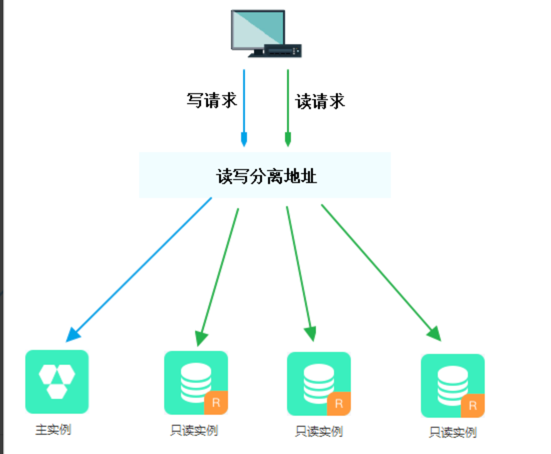

# 开通RDS读写分离

读写分离是指通过独享代理地址（读写分离地址）实现读写请求的自动转发。

背景信息

在对数据库有少量写请求，但有大量读请求的应用场景下，单个实例可能无法承受读取压力，甚至对业务产生影响。为了实现读取能力的弹性扩展，分担数据库压力，您可以创建一个或多个只读实例，利用只读实例满足大量的数据库读取需求。

创建只读实例后，您可以开通读写分离，此时独享代理地址就可以作为读写分离地址，在应用程序中配置独享代理地址，就可以使写请求自动转发到主实例，读请求自动转发到各个只读实例。

应用程序中的地址如果是主实例的内网或外网地址，则请求只会交给主实例，而不会交给只读实例处理，必须在程序中添加主实例及各个只读实例的地址及权重，才能达到读写分离地址的效果。

### 功能优势

统一读写分离地址，方便维护。

不开通读写分离时，您需要在应用程序中分别配置主实例和每个只读实例的连接地址，才能实现将写请求发往主实例而将读请求发往只读实例。
RDS读写分离功能提供一个独享代理地址，您连接该地址后即可对主实例和只读实例进行读写操作，读写请求被自动转发到对应实例，可降低维护成本。
同时，**您只需添加只读实例的个数，即可不断扩展系统的处理能力，应用程序无需做任何修改**。

原生链路支持，提升性能，减少维护成本。

**如果您在云上自行搭建代理层实现读写分离，数据在到达数据库之前需要经历多个组件的语句解析和转发，对响应延迟有较大的影响**。
而RDS读写分离内置在RDS原生生态里，能够有效降低延迟，提升处理速度，同时减少客户的维护成本。

可设权重和阈值，符合多场景使用。
您可以设置主实例和只读实例的读请求权重，以及设置只读实例的延迟阈值。

实例健康检查，提升数据库系统的可用性。

读写分离模块将自动对主实例和只读实例进行健康检查，当发现某个实例出现宕机或者延迟超过阈值时，将不再分配读请求给该实例，读写请求在剩余的健康实例间进行分配。
以此确保单个只读实例发生故障时，不会影响应用的正常访问。当实例被修复后，RDS会自动将该实例纳回请求分配体系内。

### 请求转发逻辑

只发往主实例

    INSERT、UPDATE、DELETE、SELECT FOR UPDATE。
    所有DDL操作（建表/库、删表/库、变更表结构、权限等）。
    所有事务中的请求。
    用户自定义函数。
    存储过程。
    EXECUTE语句。
    Multi Statements。
    使用到临时表的请求。
    SELECT last_insert_id()。
    所有对用户变量的查询和更改。
    SHOW PROCESSLIST。
    KILL（SQL语句中的KILL，非命令KILL）。

发往只读实例或主实例

    非事务中的SELECT。
    COM_STMT_EXECUTE命令。

总是发往所有实例

    所有系统变量的更改。
    USE命令。
    COM_STMT_PREPARE命令。
    COM_CHANGE_USER/COM_QUIT/COM_SET_OPTION等命令。

