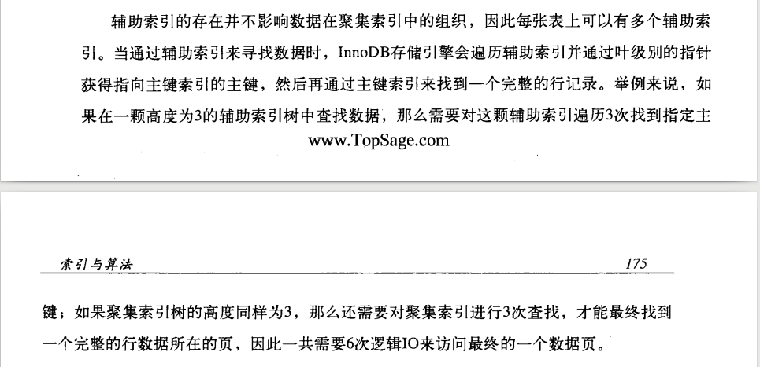
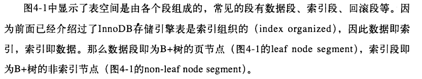

## B+

B+树索引并不能找到一个给定键值的具体行,根据B+树索引只能找到查找数据所在的页.
Innodb引擎的实现是与硬件相关的.然后数据库通过把该页读进内存.在内存中进行查找,从而得到最终数据.
每个page中的slot是按照主键的顺序存放的,对一条具体记录的查询是通过对page进行二分查找得到的.

数据库中的B+树可以分为聚集索引与非聚集索引，叶子结点存放所有数据，叶子结点连成一个有序双链表

 - 聚集索引的好处 对于主键的排序查找 以及范围查找非常快
 
 

如何标注数据在磁盘中的位置：`文件号：页号：槽号` 

