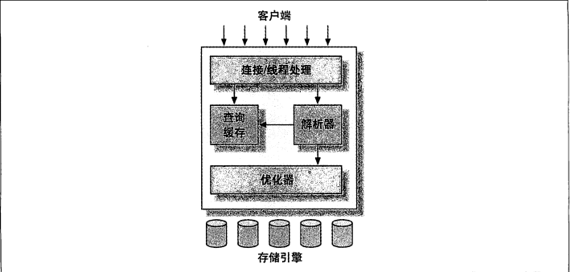

## 第一章 架构

 - 存储引擎不会解析SQL
 - 不同的存储引擎之间无法相互通信
 - 解析SQL发色和嗯在第二层
 - 事务，或者 根据主键提取记录 这种操作发生在存储引擎中，服务器层不管理事务
 
 
 
#### 连接管理 线程模型

每个客户端连接都会在服务端拥有一个线程，（至少拥有一个线程，有的客户端没有使用单例模式时 可能同一个客户端拥有多个连接实例）
服务端会对这些线程进行缓存，复用（即线程池）
达到使用少量线程来服务大量的客户端连接的目的.

也就是说 一个web站点可能同时有50000个用户并发访问，但是可能只有10-15个并发请求到MySQL服务器。

todo 连接池 与 持久连接的 区别

#### 优化与执行

查询顺序

1 接到客户端请求
2 查看查询缓存中是否有对应的查询结果，如果有 立刻返回 不在进行 sql解析 优化
3 如果没有 则对sql进行解析， 优化

#### 并发控制

多进程同时读写一个文件时，来自不同进程的数据可能会混杂在一起.
解决这类经典问题的方法就是并发控制

在处理并发读或者并发写时,通过实现一个由两种类型的的锁组成的锁系统来解决问题.
这两种类型的锁通称被称为 

 - 共享锁  别名： 读锁
 - 排它锁  别名： 写锁
 
锁的特性

 - 读锁是共享的，允许其它读锁在同一时刻共同读取同一个资源
 - 写锁是排它的，会阻塞其它的写锁或者读锁 

在数据库种，每时每刻都在发生锁定.

#### 锁粒度

锁粒度的大小决定系统的并发性能的高低,尽量精确锁定需要修改的部分,而不是全部数据可以带来更好的并发控制.
但是维护锁也会带来系统开销.所以 所谓的锁策略就是在锁开销与数据的安全性之间寻求一个平衡.

 - table lock   
 - row lock      并发性更好，但是锁开销更大.
 
#### 存储引擎

innodb在新版本中是默认的存储引擎
（因为myisam引擎不支持事务，不支持崩溃后的安全恢复，只有在少量写，数据量较小，可以忍受崩溃后部分数据丢失场景下使用）。
innodb使用MVCC来支持高并发.
innodb表是基于聚簇索引创建的
innodb真正支持热备份

innodb因为使用MVCC的并发处理架构,所以不能提供精确的数据行数统计信息.

如果在一个事务中需要操作的数据量比较大的话，我们可以考虑将数据分批，
避免大事务产生过多的undo

myisam

myisam最典型的性能问题还是表锁的问题
myisam的索引文件 与 数据文件 是分开存储的

myisam压缩表

如果只读，不更改，那么可以设置为压缩表，可以提升IO性能以及减少磁盘空间占用

人们经常会混淆 mermory 表 与 临时表 

 - 临时表指使用 create temporay table 创建的表，它可以使用任何存储引擎
 只在单个连接中可见，连接断开时 ，临时表销毁
 - memory 是表的存储引擎 数据全部存储在内存中 

排序 随机IO 顺序IO

当操作系统没有足够的内存而将一些虚拟内存写入到磁盘就会发生内存交换.
内存交换对mysql的影响是巨大的.
缺乏虚拟内存时将会导致MySQL崩溃
当交换空间溢出时,甚至整个Linux内核都会hang住

#### 事务

在同一个事务中使用多个存储引擎是不可靠的
要避免事务嵌套

MVCC 

innodb下的四种操作

    insert
    select
    update
    delete
    
MVCC 只在  repeatable read与 read commited 两种隔离级别下有效.    