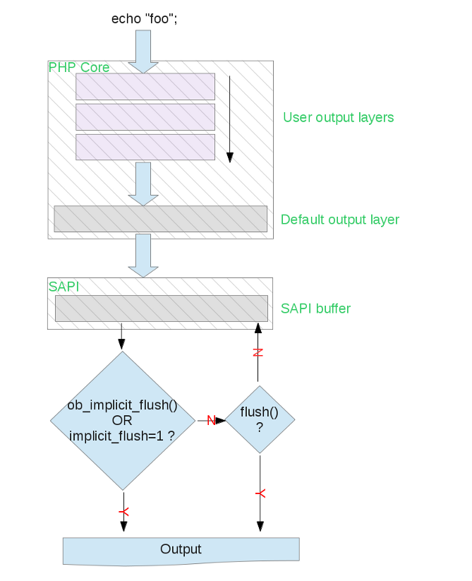

## PHP函数 de struct

在PHP中，函数分为俩种，

 - zend_internal_function, 这种函数是由扩展或者Zend/PHP内核提供的，用’C/C++’编写的，可以直接执行的函数。
 - zend_user_function, 这种函数呢，就是我们经常在见的，用户在PHP脚本中定义的函数，这种函数最终会被zendVM翻译成opcode array来执行
 
查看zend_compile.h,我们可以找到如下的3个结构:

    typedef struct _zend_internal_function {
    
    　　/* Common elements */    
    　　zend_uchar type;
    　　char * function_name;
    　　zend_class_entry *scope;
    　　zend_uint fn_flags;
    　　union _zend_function *prototype;
    　　zend_uint num_args;
    　　zend_uint required_num_args;
    　　zend_arg_info *arg_info;
    　　zend_bool pass_rest_by_reference;
    　　unsigned char return_reference;
    　　/* END of common elements */
    
    　　void (*handler)(INTERNAL_FUNCTION_PARAMETERS);
    　　　　struct _zend_module_entry *module;
    } zend_internal_function;

 

 

struct _zend_op_array {

 

 

　　/* Common elements */

 

 

　　zend_uchar type;

 

 

　　char *function_name;

 

 

　　zend_class_entry *scope;

 

 

　　zend_uint fn_flags;

 

 

　　union _zend_function *prototype;

 

 

　　zend_uint num_args;

 

 

　　zend_uint required_num_args;

 

 

　　zend_arg_info *arg_info;

 

 

　　zend_bool pass_rest_by_reference;

 

 

　　unsigned char return_reference;

 

 

　　/* END of common elements */

 

 

　　zend_uint *refcount;

 

 

　　zend_op *opcodes;

 

 

　　zend_uint last, size;

 

 

　　zend_compiled_variable *vars;

 

 

　　int last_var, size_var;

 

 

　　zend_uint T;

 

 

　　zend_brk_cont_element *brk_cont_array;

 

 

　　zend_uint last_brk_cont;

 

 

　　zend_uint current_brk_cont;

 

 

　　zend_try_catch_element *try_catch_array;

 

 

　　int last_try_catch;

 

 

　　/* static variables support */

 

 

　　HashTable *static_variables;

 

 

　　zend_op *start_op;

 

 

　　int backpatch_count;

 

 

　　zend_bool done_pass_two;

 

 

　　zend_bool uses_this;

 

 

　　char *filename;

 

 

　　zend_uint line_start;

 

 

　　zend_uint line_end;

 

 

　　char *doc_comment;

 

 

　　zend_uint doc_comment_len;

 

 

　　void *reserved[ZEND_MAX_RESERVED_RESOURCES];

 

 

};

 

 

typedef union _zend_function {

 

 

　　zend_uchar type; /* MUST be the first element of this struct! */

 

 

　　struct {

 

 

　　　　zend_uchar type; /* never used */

 

 

　　　　char *function_name;

 

 

　　　　zend_class_entry *scope;

 

 

　　　　zend_uint fn_flags;

 

 

　　　　union _zend_function *prototype;

 

 

　　　　zend_uint num_args;

 

 

　　　　zend_uint required_num_args;

 

 

　　　　zend_arg_info *arg_info;

 

 

　　　　zend_bool pass_rest_by_reference;

 

 

　　　　unsigned char return_reference;

 

 

　　} common;

 

 

　　zend_op_array op_array;

 

 

　　zend_internal_function internal_function;

 

 

} zend_function;

 

第一个结构，定义了zend_internal_function, 当PHP启动的时候 ，它会遍历每个载入的扩展模块，然后将模块中function_entry中指明的每一个函数， 
创建一个zend_internal_function结构， 并将type置为ZEND_INTERNAL_FUNCTION(见下表), 将这个结构填入全局的函数表(一个HashTable);

　　#define ZEND_INTERNAL_FUNCTION 1

　　#define ZEND_USER_FUNCTION 2

　　#define ZEND_OVERLOADED_FUNCTION 3

　　#define ZEND_EVAL_CODE 4

　　#define ZEND_OVERLOADED_FUNCTION_TEMPORARY 5

第二个结构，op_array, 这个结构很重要， 因为：

　　　　 extern ZEND_API zend_op_array *(*zend_compile_file)(zend_file_handle *file_handle, int type TSRMLS_DC);

也就是说，我们编写的PHP脚本，都会被ZE翻译成op_array, 最后交由zend_execute执行。

另外，在ZE中，用户定义的函数`userland function`, 也会被翻译成一个`op_array`, 并填入全局函数表中。
这个时候`scope`,`function_name`都不为空。
而对于在全局作用域的直接代码来说，最后的`op_array`的`scope`为全局，`function_name`为空。

第三个结构， 很有趣， 要理解这个结构，首先你要理解他的设计目标： 
 
    `zend_internal_function`
    `zend_function`
    `zend_op_array`
 
可以安全的互相转换

(The are not identical structs, but all the elements that are in “common” they hold in common,
 thus the can safely be casted to each other);

具体来说，当在op code中通过ZEND_DO_FCALL调用一个函数的时候，ZE会在函数表中，
根据名字（其实是lowercase的函数名字，这也就是为什么PHP的函数名是大小写不敏感的)查找函数， 
如果找到，返回一个zend_function结构的指针(仔细看这个上面的zend_function结构),
然后判断type,如果是ZEND_INTERNAL_FUNCTION， 那么ZE就调用zend_execute_internal,
通过zend_internal_function.handler来执行这个函数，
如果不是，就调用zend_execute来执行这个函数包含的zend_op_array.

