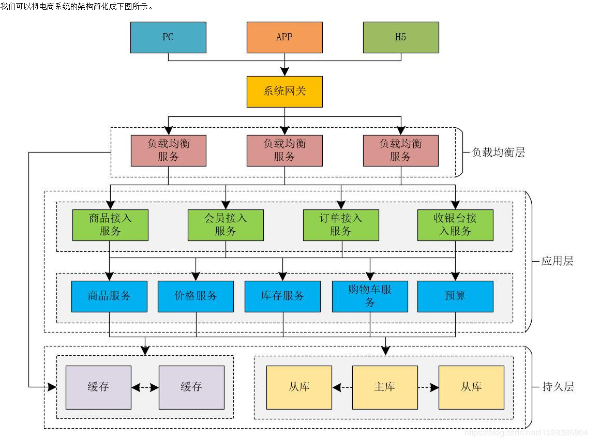
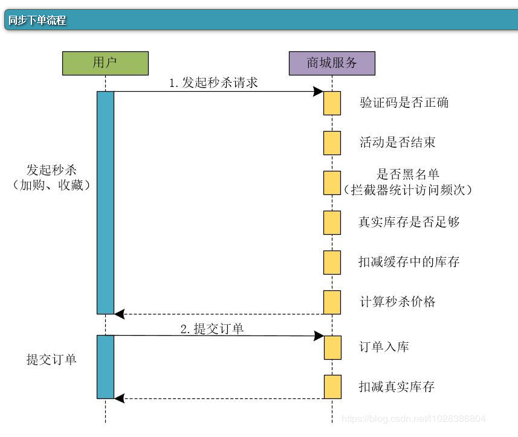
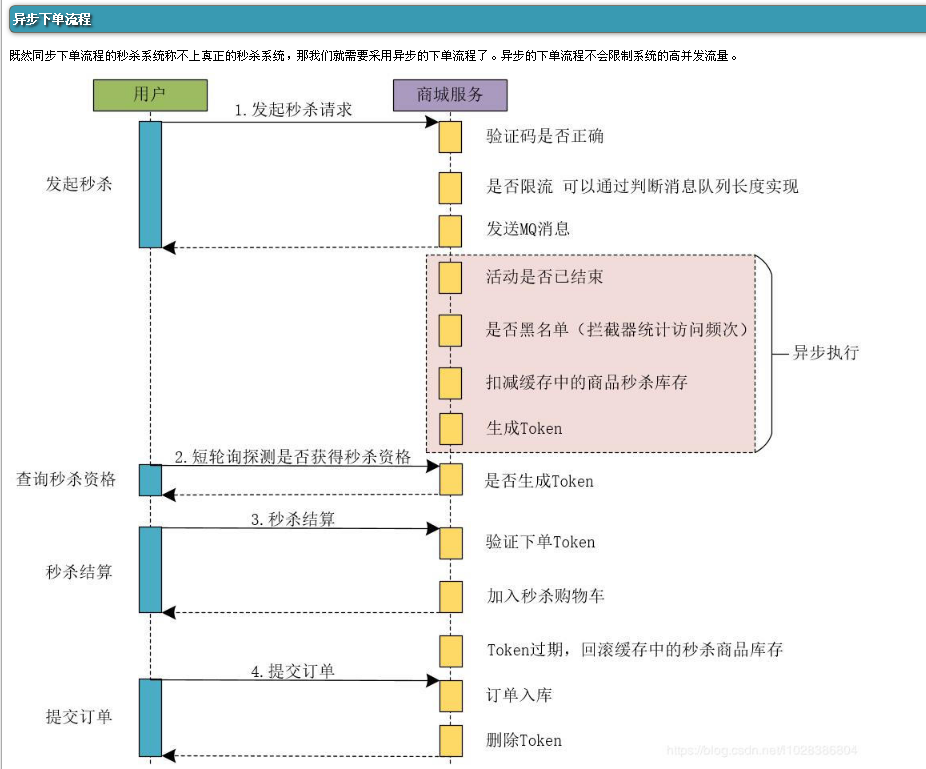

## 秒杀系统的设计

电商系统架构图

秒杀活动的特点

 - 瞬时流量高
 - 持续时间短
 - 流程简单 就一个核心:下单减库存

单纯依靠对系统扩容并不能彻底解决秒杀的瞬时流量问题.秒杀系统的解决方案.

 - 异步解耦 将整体流程进行拆解，核心流程通过队列方式进行控制.对秒杀活动的前置部分进行削峰,那么下游的压力自然变小.
 - 限流防刷 控制网站整体流量，提高请求的门槛，避免系统资源耗尽.例如防止竞争对手的恶意请求.
 - 资源控制 将整体流程中的资源调度进行控制，扬长避短.保障系统的可用性,可以牺牲部分用户体验.

#### 并发能力比较小的同步处理下单方案

同步处理秒杀方案时序图

所以，在秒杀系统中，这种同步处理下单的业务流程的方案是不可取的。
以上就是同步下单的整个流程操作，如果下单流程更加复杂的话，就会涉及到更多的业务操作。

整个流程过于复杂,导致得出秒杀结果的流程变长,对应的占用的资源就多,并发能力就低.

#### 异步下单方案

异步处理秒杀方案时序图

解析过程

##### step.1 用户发起秒杀请求,快速处理秒杀资格的发放.

用户发起秒杀请求后，商城服务会经过如下业务流程。

 1. 检测验证码: 用户发起秒杀请求时，会将验证码一同发送过来，系统会检验验证码是否有效，并且是否正确。
 2. 是否限流:系统会对用户的请求进行是否限流的判断，这里，我们可以通过判断消息队列的长度来进行判断。
因为我们将用户的请求放在了消息队列中，消息队列中堆积的是用户的请求，
我们可以根据当前消息队列中存在的待处理的请求数量来判断是否需要对用户的请求进行限流处理。
例如，在秒杀活动中，我们出售1000件商品，此时在消息队列中存在1000个请求，如果后续仍然有用户发起秒杀请求，则后续的请求我们可以不再处理，
直接向用户返回商品已售完的提示。所以，使用限流后，我们可以更快的处理用户的请求和释放连接的资源。
 3. 发送MQ: 用户的秒杀请求通过前面的验证后，我们就可以将用户的请求参数等信息发送到MQ中进行异步处理，同时，向用户响应结果信息,达到快速返回的目的.
在商城服务中，会有专门的异步任务处理模块来消费消息队列中的请求，并处理后续的异步流程。
**在用户发起秒杀请求时，异步下单流程比同步下单流程处理的业务操作更少，它将后续的操作通过MQ发送给异步处理模块进行处理，
并迅速向用户返回响应结果，释放请求连接**。

##### step.2 异步处理下单流程

我们可以将下单流程的如下操作进行异步处理。

 1. 判断活动是否已经结束
 1. 判断本次请求是否处于系统黑名单，为了防止电商领域同行的恶意竞争可以为系统增加黑名单机制，将恶意的请求放入系统的黑名单中。可以使用拦截器统计访问频次来实现。
 1. **扣减缓存中的秒杀商品的库存数量**.为了提升响应速度,将库存量进行缓存.
 1. 生成秒杀Token，这个Token是绑定当前用户和当前秒杀活动的，只有生成了秒杀Token的请求才有资格进行秒杀活动。

这里我们引入了异步处理机制，在异步处理中，系统使用多少资源，分配多少线程来处理相应的任务，是可以进行控制的。

##### step.3 短轮询查询秒杀结果

这里，可以采取客户端短轮询查询是否获得秒杀资格的方案。例如，客户端可以每隔3秒钟轮询请求服务器，查询是否获得秒杀资格，这里，我们在服务器的处理就是判断当前用户是否存在秒杀Token，如果服务器为当前用户生成了秒杀Token，则当前用户存在秒杀资格。
否则继续轮询查询，直到超时或者服务器返回商品已售完或者无秒杀资格等信息为止。
采用短轮询查询秒杀结果时，在页面上我们同样可以提示用户排队处理中，但是此时客户端会每隔几秒轮询服务器查询秒杀资格的状态，
相比于同步下单流程来说，无需长时间占用请求连接。

此时，可能会有网友会问：采用短轮询查询的方式，会不会存在直到超时也查询不到是否具有秒杀资格的状态呢？
答案是：有可能！ 这里我们试想一下秒杀的真实场景，商家参加秒杀活动本质上不是为了赚钱，而是提升商品的销量和商家的知名度，吸引更多的用户来买自己的商品。
所以，我们不必保证用户能够100%的查询到是否具有秒杀资格的状态。

##### step.4 秒杀结算

 1. 验证下单Token 客户端提交秒杀结算时，会将秒杀Token一同提交到服务器，商城服务会验证当前的秒杀Token是否有效。
 1. 加入秒杀购物车 商城服务在验证秒杀Token合法并有效后，会将用户秒杀的商品添加到秒杀购物车。

##### step.5 提交订单

 1. 订单入库 将用户提交的订单信息保存到数据库中。
 1. 删除Token
 1. 秒杀商品订单入库成功后，删除秒杀Token。

这里大家可以思考一个问题：我们为什么只在异步下单流程的粉色部分采用异步处理，而没有在其他部分采取异步削峰和填谷的措施呢？

这是因为在异步下单流程的设计中，无论是在产品设计上还是在接口设计上，我们在用户发起秒杀请求阶段对用户的请求进行了限流操作，可以说，**系统的限流操作是非常前置的**。
在用户发起秒杀请求时进行了限流，系统的高峰流量已经被平滑解决了，再往后走，其实系统的并发量和系统流量并不是非常高了。
所以，网上很多的文章和帖子中在介绍秒杀系统时，说是在下单时使用异步削峰来进行一些限流操作，那都是在扯淡！ 
因为下单操作在整个秒杀系统的流程中属于比较靠后的操作了，限流操作一定要前置处理，在秒杀业务后面的流程中做限流操作是没啥卵用的.

换句话说,只对获得秒杀资格这里进行异步处理,控制住上游流量压力,那么下游压力就会很小.

#### 秒杀活动的核心Redis

在高并发的秒杀系统中，如果采用Redis缓存数据，则Redis缓存的并发处理能力是关键，因为很多的前置操作都需要访问Redis.
而异步削峰只是基本的操作，关键还是要保证Redis的并发处理能力。解决这个问题的关键思想就是：分而治之，将商品库存分开放.
我们在Redis中存储秒杀商品的库存数量时，可以将秒杀商品的库存进行“分割”存储来提升Redis的读写并发量。
比如将1000份库存分成十份,存储在十个不同的slot上.

#### 原文连接

https://www.cnblogs.com/Leo_wl/p/12676630.html