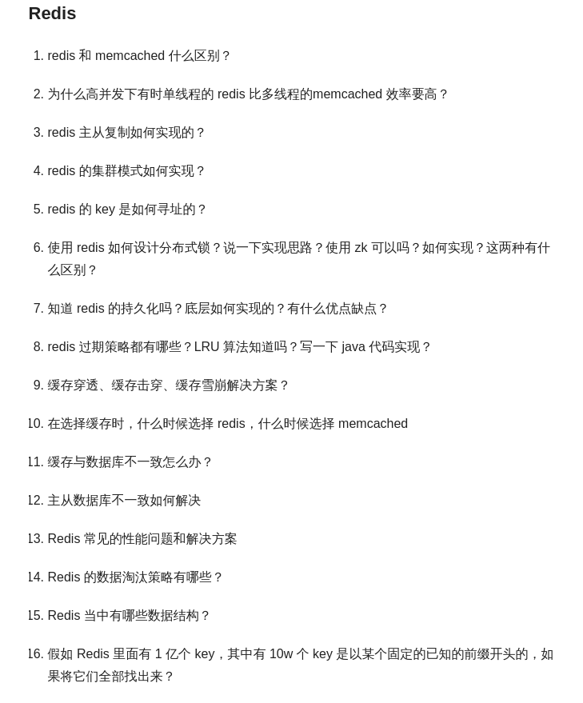

## redis 常见面试题

https://www.cnblogs.com/jiahaoJAVA/p/6244278.html

##### Redis为什么这么快

首先 redis读写操作绝大部分都是基于内存的,Redis自己构建了VM机制,减少了大量的系统调用开销.
其次 redis采用了`多路I/O复用`IO模型实现了非阻塞IO,可以使用一个线程监听多个网络链接.
然后 基于以上两点,redis可以使用单线程处理读写操作,既保障了操作的原子性,也节省了线程调度带来的系统开销以及资源竞争.
其它的点，redis里面的底层数据结构经过专门优化,保证较低时间复杂度下实现读写操作.
最后一点 redis client 与 server 的通讯协议RESP也很高效.(没有什么特色 ，如果不追问 就别说)

Redis 的客户端和服务端之间采取了一种独立名为 RESP(REdis Serialization Protocol) 的协议，作者主要考虑了以下几个点：

 - 容易实现
 - 解析快
 - 人类可读
    
注意：RESP 虽然是为Redis设计的，但是同样也可以用于其他 C/S 的软件。

##### select / poll / epoll 是多路复用的三种实现区别与联系 

 - select 有 1024 个fd的限制,采用遍历的方式
 - poll优化掉了1024个fd限制,除此之外基本与select一致
 - epoll 没有最大并发连接的限制,只检测活跃连接,使用共享内存方式代替内存拷贝(这并不意味着 select 肯定比epoll差,表现取决于应用场景) 

epoll的优点

 1. epoll 没有最大并发连接的限制，上限是最大可以打开文件的数目，这个数字一般远大于 2048, 一般来说这个数目和系统内存关系很大  ，具体数目可以 cat /proc/sys/fs/file-max 察看。
 1. 效率提升， Epoll 最大的优点就在于它只管你“活跃”的连接 ，而跟连接总数无关，因此在实际的网络环境中， Epoll 的效率就会远远高于 select 和 poll 。
 1. 内存拷贝， Epoll 在这点上使用了“共享内存 ”，这个内存拷贝也省略了。

##### redis的使用场景 

计数器 可以对 String 进行自增自减运算，从而实现计数器功能。Redis很适合存储频繁读写的计数量.
排行榜  zset
热点数据缓存/会话缓存/全页缓存 string/hash ,比如存储直播间的接入信息.
数据要求不是很严格以及数据量不是非常大的情况,redis可以充当消息队列来用.否则的话需要用专业的消息中间件来(Kafka、RabbitMQ) list
交集/差集操作,比如共同好友
实现锁 (zk)

##### redis的数据持久化方式

 - AOF  类似于binlog
 - RDB  快照,生成 dump文件 （默认启用方式）  fork 使用单独子进程来进行持久化，主进程不会进行任何 IO 操作，保证了 redis 的高性能
 
两者优缺点比较

 - AOF文件比RDB更新频率高，优先使用AOF还原数据
 - AOF比RDB更安全,AOF文件比RDB文件大
 - RDB性能比AOF好
 - 如果两个都配了优先加载AOF
     
如何选择合适的持久化方式

 - 如果你只希望你的数据在服务器运行的时候存在，你也可以不使用任何持久化方式
 - 如果可以忍受段时间内(例如分钟以内)的数据丢失，数据要求不严谨,那么你可以只使用RDB持久化
 - 对数据要求极为严格,选择两种配合使用.

##### redis的过期键删除策略

 - 定时过期：每个设置过期时间的key都需要创建一个定时器，到过期时间就会立即清除。该策略可以立即清除过期的数据，对内存很友好；但是会占用大量的CPU资源去处理过期的数据，从而影响缓存的响应时间和吞吐量。
 - 惰性过期：只有当访问一个key时，才会判断该key是否已过期，过期则清除。该策略可以最大化地节省CPU资源，却对内存非常不友好。极端情况可能出现大量的过期key没有再次被访问，从而不会被清除，占用大量内存。
 - 定期过期：每隔一定的时间，会扫描一定数量的数据库的expires字典中一定数量的key，并清除其中已过期的key。该策略是前两者的一个折中方案。通过调整定时扫描的时间间隔和每次扫描的限定耗时，可以在不同情况下使得CPU和内存资源达到最优的平衡效果。
 
默认情况下Redis中同时使用了惰性过期和定期过期两种过期策略。
     
##### redis的热点数据淘汰策略/ 如何保障redis中存储的都是热点数据

设置合适的数据淘汰策略,比如选择`allkeys-lru`策略.

答案解释:

Redis的内存淘汰策略是指在Redis的用于缓存的内存不足时，怎么处理需要新写入且需要申请额外空间的数据。
**Redis的内存淘汰策略的选取并不会影响过期的key的处理**。内存淘汰策略用于处理内存不足时的需要申请额外空间的数据

实际上Redis定义了几种策略用来处理这种情况：（6种redis内存淘汰策略方案）

 - noeviction(**默认策略**)：对于写请求不再提供服务，直接返回错误（DEL请求和部分特殊请求除外）
 - allkeys-lru：    从所有key中使用LRU算法进行淘汰 (**这个是最常用的**)
 - allkeys-random： 从所有key中随机淘汰数据
 - volatile-lru：   从设置了过期时间的key中使用LRU算法进行淘汰
 - volatile-random：从设置了过期时间的key中随机淘汰
 - volatile-ttl：   在设置了过期时间的key中，根据key的过期时间进行淘汰，越早过期的越优先被淘汰

LRU是什么？按照英文的直接原义就是`Least Recently Used`,**最近最久未使用法**，它是按照一个非常著名的计算机操作系统基础理论得来的：
最近使用的页面数据会在未来一段时期内仍然被使用,已经很久没有使用的页面很有可能在未来较长的一段时间内仍然不会被使用。

##### Redis的内存用完了会发生什么？

 - 如果达到设置的上限，Redis的写命令会返回错误信息（但是读命令还可以正常返回）。
 - 如果你可以配置内存淘汰机制，当Redis达到内存上限时会淘汰一部分数据清理空间。

##### redis如保障操作的原子性

redis的操作是单线程,线程是系统调度的最小单位.

##### 缓存穿透/缓存雪崩解决思路

 - 避免缓存集体失效,为缓存随即设置过期时间
 - 当大量缓存穿透到数据库层时,对查询操作进行去重,排队操作
 - 后台单起服务负责更新将要过期的缓存
 - 多级缓存
 
缓存雪崩的事前事中事后的解决方案如下。
 
 - 事前：进行系统压力测试，在负载均衡层做限流处理，过载丢弃请求或者进入队列
 - 事前：redis 高可用，主从+哨兵，redis cluster，避免全盘崩溃。
 - 事中：本地 ehcache 缓存 + hystrix 限流&降级，避免 MySQL 被打死。
 - 事后：redis 持久化，一旦重启，自动从磁盘上加载数据，快速恢复缓存数据。
 
##### 排行榜的实现 排行榜/带权重的消息队列

 - Scenario 1: The higher the user scores, the higher the ranking. In the same score case, redis uses dictionary sort
 - Scenario 2: User games take the shortest time, ranking ahead         
 - Scenario 3: The higher the user’s score, the higher the ranking. If the score is the same, the user who first achieves the score is in front of the ranking.
 - Scenario 2: The shortest time for the user to complete the game is ahead of the queue. If the time for completing the game is the same, the user who reaches the record first is ahead of the queue.    

We can subtract the time stamp from the same large number MAX (e.g. 5000000000 000). 
The smaller the time stamp, the greater the difference. 
So we can change the structure of score to:Fractions +’+ (MAX-timestamp)So we can meet our needs.
If you use integers as scores, one thing to note is that the largest integer in JS is.
Therefore, the best score structure is: fraction +’.’+ timestamp, which becomes floating-point number.

Score.timestamp : 

    User1: 100.(Max - 145454565657)
    User2: 100.(Max - 145454565658)

change the user’s score composition.

Score.timestamp : 

    User1: 100.145454565657
    User2: 101.145454565657

##### redis 如何实现事务 

这里接触的比较少,不太熟悉.

#### MySQL里有2000w数据，redis中只存20w的数据，如何保证redis中的数据都是热点数据

 相关知识：redis 内存数据集大小上升到一定大小的时候，就会施行数据淘汰策略。redis 提供 6种数据淘汰策略：

voltile-lru：从已设置过期时间的数据集（server.db[i].expires）中挑选最近最少使用的数据淘汰

volatile-ttl：从已设置过期时间的数据集（server.db[i].expires）中挑选将要过期的数据淘汰

volatile-random：从已设置过期时间的数据集（server.db[i].expires）中任意选择数据淘汰

allkeys-lru：从数据集（server.db[i].dict）中挑选最近最少使用的数据淘汰

allkeys-random：从数据集（server.db[i].dict）中任意选择数据淘汰

no-enviction（驱逐）：禁止驱逐数据